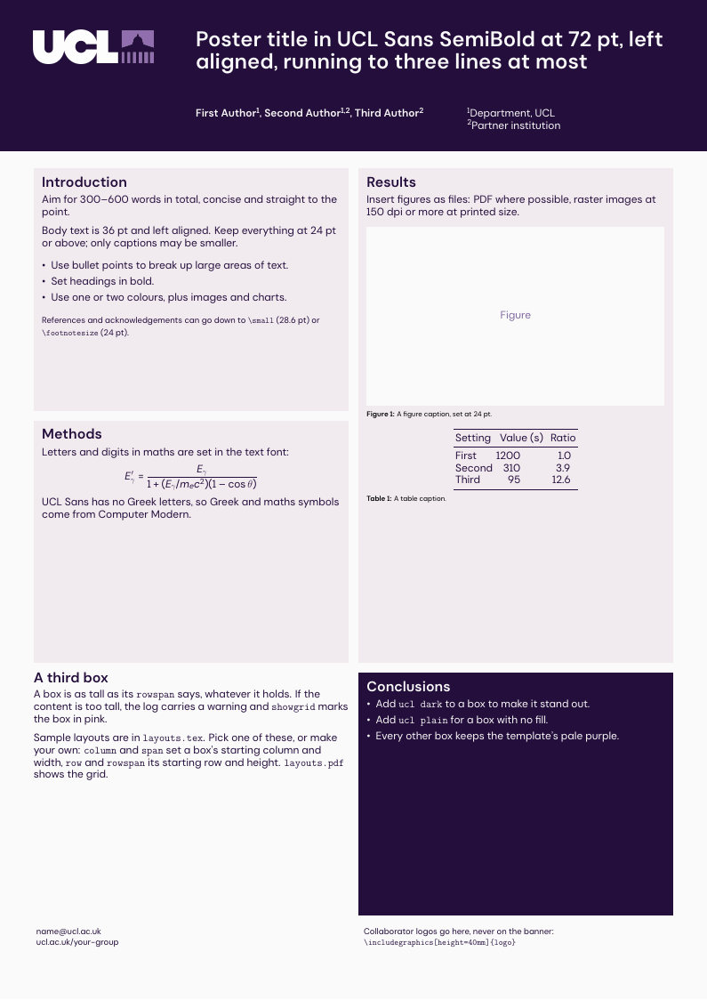

# uclposter: UCL A0 portrait poster for LaTeX

A LaTeX class for research posters that resemble UCL's current A0 portrait PowerPoint template (`UCL-A0_Poster_Template-Portrait.pptx`: new logo, UCL Sans, dark purple banner).

**Unofficial.** This template is not produced or endorsed by UCL. UCL provides poster templates in PowerPoint format (.pptx) through the [UCL Brand resources](https://imagestore.ucl.ac.uk/imagestore/files/ucl-new-templates/UCL/UCL%20A0%20Academic%20Posters/UCL-A0%20Poster%20Template-Portrait.pptx), but no LaTeX templates. This repository is a recreation that follows UCL's brand guidelines, for students and staff who prefer LaTeX.

## Quick start

1. Download this repository (green **Code** button, then **Download ZIP**), or click **Use this template** to make your own copy.
2. Edit `poster.tex`.
3. Compile with LuaLaTeX or XeLaTeX:

       lualatex poster.tex

**Overleaf:** upload the ZIP as a new project, then set the compiler to LuaLaTeX (or XeLaTeX) in the project settings.

pdfLaTeX also compiles the poster, but it cannot load UCL Sans and falls back to a Helvetica clone, so the result is not on brand.

Requires a LaTeX installation from 2021 or later with `tcolorbox`, `mathastext`, `enumitem`, `caption` and `kvoptions` (all in a full TeX Live or MiKTeX). Tested with TeX Live 2023 and Overleaf.

## Files

| File | What it is |
|---|---|
| `uclposter.cls` | the poster class defining how everything looks |
| `poster.tex`, `poster.pdf` | a starting poster and its output |
| `layouts.tex`, `layouts.pdf` | the template's eight sample layouts, one per page, to copy or adapt |
| `fonts/` | UCL Sans (`.otf` and `.ttf`) and its licence, `OFL.txt` |
| `logos/` | the two UCL logos used on the banner |

Keep `uclposter.cls`, `fonts/` and `logos/` next to your `.tex` file.

## Header and footer

    \title{...}        % 72 pt SemiBold, up to three lines
    \author{...}       % 36 pt SemiBold, up to three lines
    \affiliation{...}  % 36 pt Regular, up to three lines
    \contact{...}      % bottom left, 28.6 pt
    \footerlogos{...}  % bottom right: \includegraphics[height=40mm]{...}

Their positions are fixed by the template. The sizes may move within the template's ranges (authors 36-48 pt, affiliation 24-36 pt), for example:

    \renewcommand\uclauthorfont{\fontsize{48pt}{52pt}\bfseries\selectfont}

## Content boxes

The content area is a grid of 12 columns and 6 rows with 12 mm gaps, following the guides the PowerPoint layouts are drawn on. Boxes are tcolorbox poster boxes:

    \begin{uclposter}
      \posterbox[title=Methods]{column=1,span=6,row=1,rowspan=3}{ ... }
      \posterbox[ucl dark,title=Conclusions]{column=7,span=6,row=5,rowspan=2}{ ... }
    \end{uclposter}

- `column`, `row`: the top-left cell. `span`, `rowspan`: width and height in cells. Sizes may be fractions (`span=3.5`); `column` and `row` must be whole numbers.
- `title=` is the bold heading. Styles: pale purple (default), `ucl dark`, `ucl plain` (no fill).
- Boxes have a fixed height. Content that is too tall spills out; the log then says by how many mm, and `showgrid` marks the box in pink.
- For a box as tall as its content, give boxes a `name=` and use `below=<name>` instead of `row`. Use `between=<name> and bottom` to fill what is left.
- `xshift=` and `yshift=` nudge a box off the grid.
- For a different grid: `\begin{uclposter}[poster={columns=5,rows=8,spacing=20mm}]`.
- For verbatim content use `\begin{posterboxenv}[title=..]{column=..} ... \end{posterboxenv}`.
- Everything else in the tcolorbox manual (poster library) applies.

`layouts.tex` has the template's layouts ready to copy. Compile with the
`showgrid` class option while arranging boxes: it draws the grid and the template's margins.

Figures and tables are not floats inside a box: use `\includegraphics` and `\captionof{figure}{...}` / `\captionof{table}{...}`.

## Class options

| Option | Effect |
|---|---|
| `banner=dark` (default) / `banner=light` | dark purple banner with the light logo, or plain banner with the dark logo |
| `showgrid` | draws the 12 x 6 grid and the template guides, and marks overfull boxes |
| `sansmath=false` | leaves maths in Computer Modern |
| `fontdir=<folder>/` | where to look for the font files (default `fonts/`) |
| `font=<name>` | use another installed font family |

## Font and maths

The template uses **UCL Sans** for body text and **UCL Sans SemiBold** for the title, authors and headings. The class looks for the font in this order and prints the one it used at the end of the log (`uclposter: text font = ...`):

1. UCL Sans installed on the computer;
2. the files in `fonts/` (it loads four: `UCLSans-Regular`, `-Italic`, `-SemiBold`, `-SemiBoldItalic`);
3. Aptos, UCL's stated fallback;
4. TeX Gyre Heros, with a warning.

`\textbf` gives SemiBold, as in the template. The other weights in `fonts/` (Light, Medium, Bold, ...) are there if you want to load them with `fontspec`.

Letters and digits in maths are set in UCL Sans (via `mathastext`) so that equations match the text. UCL Sans has no Greek alphabet, so Greek letters and maths symbols come from Computer Modern. With `siunitx`, add `\sisetup{mode=text}` to set numbers and units in UCL Sans.

## UCL's guidance for posters

- Do not move or resize the logo, and put **no other logo on the banner**.
- 300-600 words. Nothing under 24 pt except captions.
- One or two colours from the palette, plus images and charts.
- Images at 150 dpi or more at printed size.

## Limitations

- A0 portrait only (print at 71% for A1). There is no landscape variant.
- Not tested on MiKTeX yet.

## Licence

- **Code** (`uclposter.cls`, `poster.tex`, `layouts.tex`): MIT, see `LICENSE`.
- **UCL Sans** (`fonts/`): SIL Open Font License 1.1, see `fonts/OFL.txt`.
  UCL Sans is based on DM Sans by Colophon Foundry and Jonny Pinhorn.
- **UCL logos** (`logos/`): property of UCL, not covered by the MIT licence.
  See `logos/README.md`.

## Acknowledgements

Built using [tcolorbox](https://ctan.org/pkg/tcolorbox) (poster library) and [mathastext](https://ctan.org/pkg/mathastext).

This project does for the new brand what earlier LaTeX templates did for the previous one: [UCL/ucl-beamer](https://github.com/UCL/ucl-beamer) and [kinianlo/ucl-tikzposter](https://github.com/kinianlo/ucl-tikzposter). It shares no code with them.
